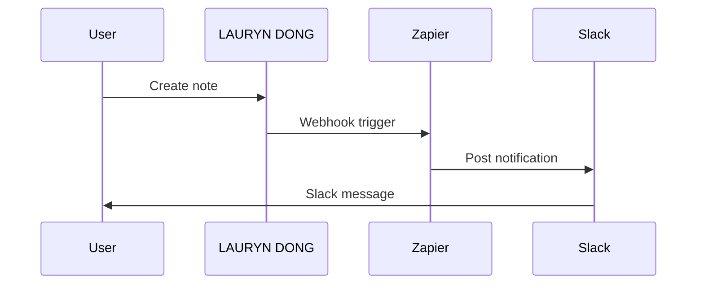

## Overview

LAURYN DONG supports seamless integrations with popular third-party services, webhooks for custom automations, and full API access for advanced use cases. You can connect email providers, calendars, and automation platforms like Zapier to streamline your data workflows.

<Columns cols={3}>
  <Card title="Third-Party Apps" icon="plug" href="#third-party">
    Connect Gmail, Outlook, Google Calendar, and more.
  </Card>
  <Card title="Webhooks" icon="zap" href="#webhooks">
    Receive real-time events for custom integrations.
  </Card>
  <Card title="API Access" icon="code" href="#api">
    Build custom solutions with our REST API.
  </Card>
</Columns>

## Third-Party App Connections

Connect LAURYN DONG directly to email and calendar services without code. Navigate to the Integrations dashboard at `https://dashboard.example.com/integrations` and select your provider.

<Tabs>
  <Tab title="Email (Gmail)" icon="mail">
    Authorize Gmail access to send automated notifications on new entries.
  </Tab>
  <Tab title="Calendar (Google)" icon="calendar">
    Sync events to Google Calendar for scheduling reminders.
  </Tab>
</Tabs>

<Callout kind="tip">
  Test connections in sandbox mode first to verify data flow.
</Callout>

## Webhook Setup

Set up webhooks to trigger actions in external systems when events occur in LAURYN DONG, such as new notes or updates.

<Steps>
  <Step title="Create Webhook" icon="plus">
    Go to `https://dashboard.example.com/webhooks` and click "New Webhook".
  </Step>
  <Step title="Configure Events" icon="settings">
    Select events like `note.created` or `note.updated`.
  </Step>
  <Step title="Add Endpoint" icon="link">
    Enter your endpoint URL, e.g., `https://your-webhook-url.com/webhook`.
  </Step>
  <Step title="Verify" icon="check-circle">
    Send a test event and check your endpoint logs.
  </Step>
</Steps>

Configure the webhook payload with these parameters:

<ParamField path="event" param-type="string" required="true">
  The event type, e.g., `note.created`.
</ParamField>

<ParamField header="X-Signature" param-type="string" required="false">
  HMAC signature for payload verification using your webhook secret.
</ParamField>

Example payload:

<Response show-lines="false">
```json
{
  "event": "note.created",
  "data": {
    "id": "note_123",
    "title": "Meeting Notes",
    "content": "Discuss project updates"
  },
  "timestamp": "2024-10-15T10:30:00Z"
}
```
</Response>

## API Access for Advanced Integrations

Use the LAURYN DONG REST API at `https://api.example.com/v1` for programmatic access. Authenticate with `Authorization: Bearer YOUR_API_KEY`.

<CodeGroup tabs="JavaScript,Python">
```javascript
const response = await fetch('https://api.example.com/v1/notes', {
  headers: {
    'Authorization': 'Bearer YOUR_API_KEY'
  }
});
const notes = await response.json();
console.log(notes);
```

```python
import requests

headers = {'Authorization': 'Bearer YOUR_API_KEY'}
response = requests.get('https://api.example.com/v1/notes', headers=headers)
notes = response.json()
print(notes)
```
</CodeGroup>

<Callout kind="alert">
  Store your `API_KEY` securely and rotate it regularly.
</Callout>

## Popular Use Cases

Integrate with Zapier for no-code automations.



<Expandable title="Zapier Integration Details" default-open="true">
  1. Create a Zap in Zapier.
  2. Use Webhook by Zapier as trigger.
  3. Set URL to your LAURYN DONG webhook.
  4. Map fields like `note.title` to actions in Slack, Trello, etc.
</Expandable>

Explore more in our [Quickstart](/quickstart) for initial setup.